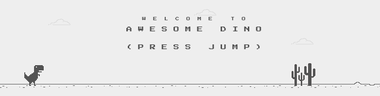

## AWESOME DINO
A Java version ot the offline T-Rex chrome game.
Some features are missing, some additional has been added.
Game works on ~**60 fps**.

Game is for my CS project.
### Features
   - Obstacles manager
   - Moving ground
   - Jump
   - Score & High Score _(W/R file)_
   - Faster fall
   - Leveling system
   - Pause
   - Moving background
   - Changing background color
   - Sounds
   - **EASTER EGG** _(search for it in intro screen)_
   - Collisions + array of collision box (for example) 
   

### Keybinds:
##### Jump: `SPACE`, `w`, `ARROW UP`
##### Fall: `s`, `ARROW DOWN`
##### Pause: `p`, `ESC`
##### Debug mode: <code>` (backtick)</code>

