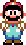

## 🦖 AWESOME DINO
    
A Java version ot the offline T-Rex chrome game.
Some features are missing, some additional has been added.
Game works on ~**60 FPS**.

Game is for my CS project.
## Features
   - Obstacles
   - Collisions
   - Moving ground
   - Moving background
   - Changing background color
   - Jump
   - Faster fall
   - Animations
   - Score & High Score _(W/R file)_
   - Leveling system
   - Intro
   - Pause
   - Sounds
   - **EASTER EGG** _(you need to click somewhere in intro screen)_

## How to start
1. Clone git
2. Run from "GameStarter" class

## Keybinds
##### Jump: `SPACE`, `w`, `ARROW UP`
##### Fall: `s`, `ARROW DOWN`
##### Pause: `p`, `ESC`
##### Debug mode: <code>` (backtick)</code>

## TODO
- Pterodactyl
- Hardcore mode
- Even better collisions
- Better moving background
- Better main game loop and FPS system
- Background color fade transition
- ... and most importantly **Better code (like always)**

## Thanks for watching

